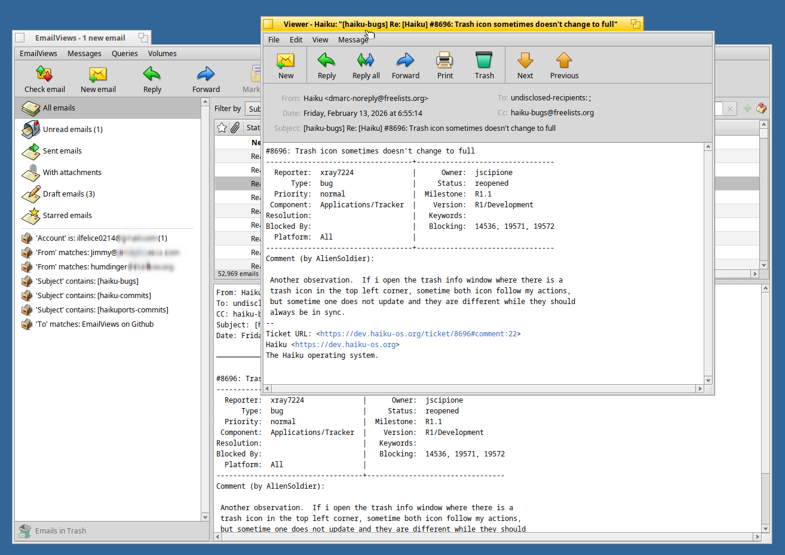

# EmailViews

EmailViews is a fast, lightweight native email client for the [Haiku](https://www.haiku-os.org) operating system that uses live queries to view, organize, and manage your emails effortlessly in a single, cohesive interface.

EmailViews integrates seamlessly with Haiku's built-in `mail_daemon` and Mail Kit, reading emails directly from disk — along with their file attributes — so there's no import or sync required. Just launch it, and it automatically finds and displays all your email messages. Start querying, composing, replying, and managing your mailboxes right away.



EmailViews was created using AI tools and is maintained by Jorge Mare.

## Features

- **Three-pane interface** — Sidebar with mail views, sortable email list, and inline preview pane. Double-click any email to open it in a full reader window.
- **Built-in views** — All Emails, Unread, Sent, With Attachments, Drafts, and Starred. Each view shows an unread count badge that updates in real time.
- **Custom queries** — Create your own views filtered by subject, sender, recipient, or account. Custom queries are saved as standard Haiku query files and appear in the sidebar alongside built-in views.
- **Live updates** — Email views are powered by live `BQuery` objects and node monitors. New mail appears instantly without manual refresh.
- **Full reader and composer** — Open emails in a dedicated reader window with reply, forward, and signature support. Compose new messages with address auto-completion from People files and spell checking.
- **Attachment handling** — Visual attachment strip shows file icons, names, and sizes. Open attachments with their preferred application or save them to disk. Supports drag-and-drop.
- **HTML email support** — Emails with HTML content can be viewed in the default browser via a button in the preview pane, preserving the original formatting and character encoding.
- **Search and filter** — Search the current view by subject, sender, or recipient. An optional time range slider lets you narrow results to a specific date window.
- **Starred emails** — Star important emails with a single click. Stars are stored as a file attribute (`FILE:starred`) so they persist across sessions and are queryable.
- **Sortable columns** — Click any column header to sort by status, star, attachment, sender/recipient, subject, date, or account. Drag columns to reorder them. Column layout is saved per view.
- **Keyboard navigation** — Arrow keys, Page Up/Down, Home/End for list navigation. Enter to open, Delete to trash. Shift-click and Shift-arrows for multi-selection. Alt+A to select all emails in the current view.
- **Trash management** — Move emails to trash, restore them to their original location, or permanently delete them. The trash view shows a count badge and supports emptying all at once. A confirmation dialog is shown when moving 50 or more emails to trash at once.
- **Undo move to Trash** — Press Alt+Z (or use Messages → Undo Move to Trash) to restore the most recently trashed batch of emails back to their original location, without having to navigate to the Trash view. Supports up to 10 levels of undo.
- **Email backup** — Back up the current view's emails to a ZIP archive via the toolbar search bar's menu.
- **Deskbar integration** — An optional Deskbar replicant shows the unread mail count in the system tray with a popup menu for quick access.
- **Multi-volume support** — Query and manage emails across multiple mounted volumes. Select which volumes to include via the Volumes menu.
- **Dark theme support** — Respects Haiku's system colors and works with both light and dark themes.
- **Localization** — The app is localization ready.
- **Spam filter** — Basic sender-based spam filter with blocked email addresses and domain management. Right-click on a message to mark the sender as spam.

## Requirements

- At least one email account configured in Haiku's E-mail preferences
- `mail_daemon` running (starts automatically when email accounts are configured)
- EmailViews was developed in 64-bit Haiku, but should compile and run on R1/beta 5 and after

## Building

EmailViews uses Haiku's standard makefile engine:

```sh
make
```

To build a release version:

```sh
make OPT_NOASSERT=1
```

The resulting `EmailViews` binary is placed in the current directory (or under `objects.*-release/` depending on your build configuration).

## Installation

Copy the `EmailViews` binary anywhere you like — `/boot/home/apps/` is a common choice. No additional files are needed; all resources (icons, translations) are embedded in the binary.

To launch, double-click the binary or run it from Terminal:

```sh
EmailViews
```

On first run, EmailViews creates a `queries` directory in its settings folder (`~/config/settings/EmailViews/queries/`) to store any custom queries you create.

### HaikuDepot availability

EmailViews can now be installed from the HaikuDepot app or from terminal using the following command:

```
pkgman install emailviews
```
## Usage tips

- **Creating custom queries**: Right-click an email in the list and choose "Add 'From' query", "Add 'To' query", or "Add 'Account' query" from the Messages menu to create a filtered view for that sender, recipient, or account.
- **Time range filtering**: Press Alt+Shift+T to toggle the time range slider, which lets you narrow results to a specific date range.
- **Starring emails**: Click the star column in the email list, or use the toolbar button in the reader window.
- **Deskbar replicant**: Enable via the EmailViews menu → "Show in Deskbar". The tray icon shows the current unread count.
- **Column customization**: Drag column headers to reorder, click to sort. Each view remembers its own column layout.
- **Select all**: Press Alt+A to select all emails in the current view. Reply, Forward, and navigation buttons are disabled in this mode to prevent accidental bulk actions.
- **Undo delete**: Press Alt+Z immediately after moving emails to Trash to restore them to their original location. Each press undoes one delete operation.
- **Bulk delete safeguard**: Moving 50 or more emails to Trash at once requires confirmation.

## Keyboard shortcuts

| Shortcut | Action |
|----------|--------|
| Alt+N | New email |
| Alt+R | Reply |
| Alt+Shift+R | Reply all |
| Alt+Shift+F | Forward |
| Alt+M | Mark as read |
| Delete | Move selected email to Trash |
| Alt+Z | Undo Move to Trash |
| Alt+A | Select all |
| Alt+S | Focus search |
| Alt+Shift+T | Toggle time range slider |
| Enter | Open selected email |
| Arrow keys | Navigate email list |
| Shift+Arrow | Extend selection |
| Page Up/Down | Scroll by page |
| Home/End | Jump to first/last email |
| Alt+S | Focus search field |
| Alt+, | Open Email preferences |

## Credits

EmailViews is built on the shoulders of Haiku's mail kit and draws inspiration from several Haiku applications:

- **Haiku Mail** (Mail application by the Haiku Project) — reader/composer foundation
- **Beam** by Oliver Tappe — attribute search UI and attachment handling patterns
- **QuickLaunch** by Humdinger — Deskbar replicant integration
- **Tracker** by the Haiku Project — file management patterns
- **Icons** from the Haiku and Zumi icon sets.

**Special thanks** to **Humdinger** for meticulous testing, detailed bug reports, valuable feature suggestions, and code contributions.

## License

Distributed under the terms of the MIT License.
